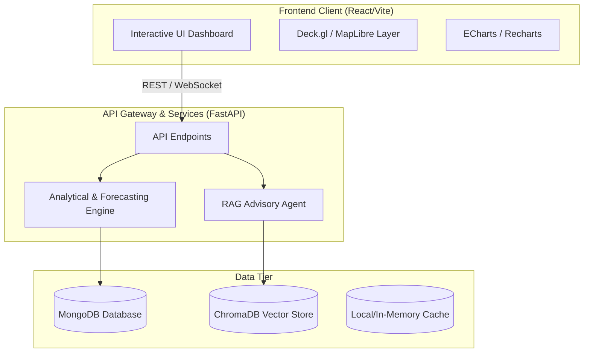
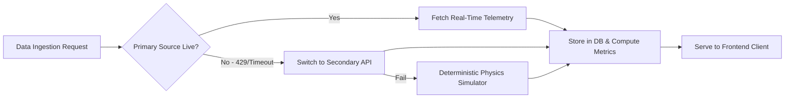
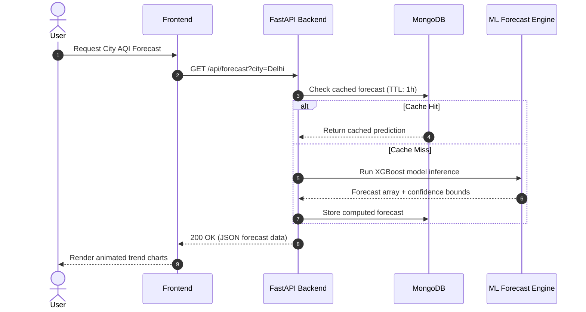

# Understand-Anything Architecture Visualizer

This skill turns complex codebases into intuitive, visual architecture maps and diagrams using Mermaid.js and structured flow charts.

---

## 1. System Architecture Mapping Workflow

When asked to explain, analyze, or visualize a system:

1. **Identify the Core Architectural Layers**:
   - **Ingestion & Data Sources**: Raw APIs, sensors, scrapers, message queues.
   - **Domain & Processing Engines**: Forecasters, ML models, heuristic calculators, background workers.
   - **State & Storage**: Databases (MongoDB, PostgreSQL), Caches (Redis), Vector stores (ChromaDB).
   - **API & Gateway Layer**: FastAPI/Express endpoints, auth middlewares, validation schemas.
   - **Frontend & Presentation**: Client dashboards, map renderers, live charts, interactive controls.

2. **Render High-Clarity Mermaid Diagrams**:
   - Always wrap node labels with quotes if they contain special characters.
   - Group related components into subgraphs.
   - Annotate arrows with protocols (HTTP, WS, gRPC) and data types.

---

## 2. Standard Diagram Templates

### Layered Architecture Diagram

### Data Pipeline & Degradation Flow

### Sequence Diagram

