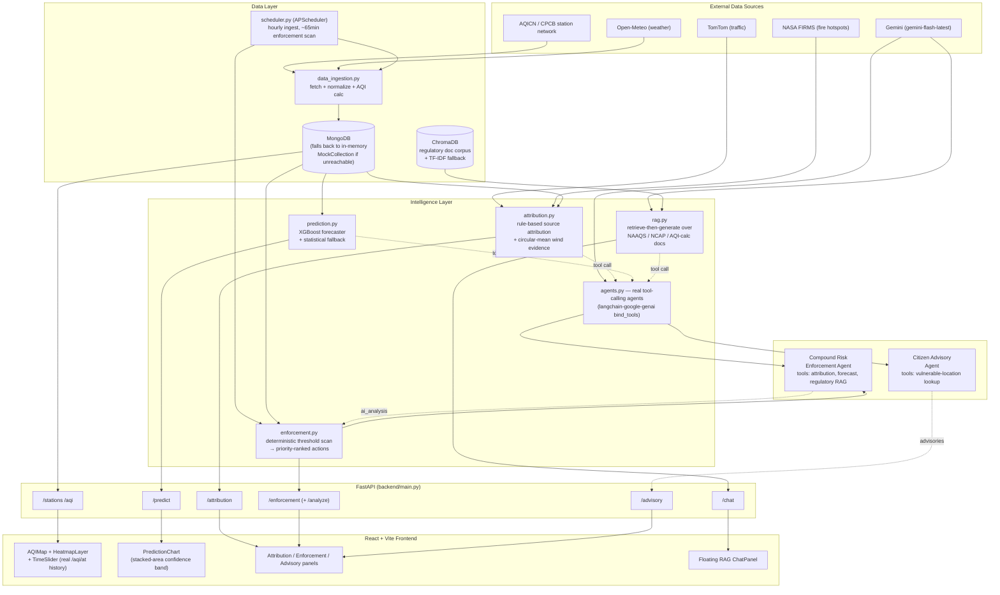

# VayuDrishti — System Architecture

This diagram reflects what the codebase actually does, not an aspirational pitch: every
box below corresponds to a real, runnable module in `backend/` or `frontend/src/`.

## High-level flow

## Why this differs from a typical "AQI dashboard"

Most teams tackling this problem statement will ship a map with colored dots and maybe
a chart. Three things in this architecture specifically target the judging rubric:

**1. The agents are real tool-calling loops, not prompt wrappers.**
`backend/services/agents.py` binds Gemini to actual Python tools via
`ChatGoogleGenerativeAI.bind_tools()` and runs a ReAct-style loop
(`_run_tool_calling_agent`) where the model decides which tool(s) to call and in what
order. The **Compound Risk Enforcement Agent** is what the problem statement calls a
"Compound Risk Detection Engine" concretely: it takes a single rule-detected pollutant
breach and independently cross-references source attribution *and* the forecast trend
before deciding whether it's an isolated blip or a genuine compound risk — the same
kind of correlation a single sensor can't make on its own.

**2. The ML forecaster is evaluated the way the problem statement asks — at every
horizon.** `backend/ml/train_model.py` trains one XGBoost model **per horizon**
(6/12/24/48/72h), each predicting that horizon *directly* from real lag/rolling
features (pandas `shift`/`rolling`, not independent random draws), with a
chronological train/test split (a random split would leak the future). The
forecaster interpolates the hourly curve between these direct anchors. This
replaced an earlier scheme that applied the single 24h model in an hourly
recursive loop — which compounded error and lost to persistence; the multi-horizon
backtest (`ml/backtest.py`) is what caught it. Current backtest vs a naive
persistence baseline (the exact metric named in the evaluation focus):
**24h 13.83 vs 19.00 (+27.2%), 48h 13.76 vs 19.22 (+28.4%), 72h 13.78 vs 18.78
(+26.6%)**. Each forecast also ships an exact TreeSHAP attribution (XGBoost
`pred_contribs`, no external `shap` dependency).

**3. Every "AI" path has a deterministic fallback.**
No feature depends on an LLM being reachable. If `GEMINI_API_KEY` is unset or a Gemini
call fails, advisories fall back to static templates, enforcement stays fully
rule-based, and forecasts fall back to a statistical (mean-reversion + diurnal +
compounding-uncertainty) model. If MongoDB is unreachable, `models/database.py`
transparently swaps in an in-memory mock database supporting the query operators the
app actually uses. A fresh clone with zero configuration is a fully working demo.

## Tier-1 intelligence subsystems (the win-chain)

Each is a link in one coherent chain — forecast → GRAP order → evidence → human
impact → citizen voice → response-time counter — and each accepts an optional
`at` timestamp so the entire platform can operate as of a historical moment
(replay mode).

- **`services/replay.py`** — loads honestly-labelled episode datasets
  (`data/episodes/*.json`) calibrated to real reported peaks, materialises hourly
  readings into the DB (idempotent; ephemeral for downstream services), and
  threads a replay `at` through forecast/attribution/GRAP/enforcement/advisory.
  Exposes a boundary-layer *transport* wind for trajectories (distinct from the
  surface calm that traps local emissions).
- **`services/grap.py`** — forecast-triggered GRAP engine. CAQM stage thresholds;
  the trigger is the earliest *sustained* (≥3h) crossing by the ML forecast **or**
  a persistence-with-trend projection, and the drafted CAQM-style order records
  which signal fired, the lead time gained, and the real statutory action
  checklist per stage with responsible agencies.
- **`services/attribution.py`** — CPF (Conditional Probability Function)
  wind-sector confidence + PMF-calibrated priors + measured-chemistry
  likelihoods; every covariate carries a source label; no random inputs (a
  regression test fails if `random` re-enters the module).
- **`services/trajectory.py`** — 2D kinematic back-trajectory intersected with
  fire detections; produces the "air mass crossed N fires Xh ago" provenance.
- **`services/health_impact.py`** — AQLI life-years, WHO AirQ+ excess deaths
  (log-linear CRF capped at its validated range), and population-weighted
  exposure; pure arithmetic over cited coefficients.
- **`services/gov_feed.py`** — adapter for the official data.gov.in CPCB CAAQMS
  feed (the live scalability proof).
- **`services/llm_cache.py`** — cached-first LLM serving (Mongo + JSON-file
  fallback) so the demo never stalls on a Gemini rate limit.
- **Forecaster explainability** — `prediction.explain_forecast()` returns exact
  TreeSHAP contributions via XGBoost `pred_contribs` (no `shap` dependency).

## Data flow for a single "compound risk" detection, end to end

1. `scheduler.py` triggers `enforcement.scan_for_anomalies_and_generate_actions(city)`
   every ~65 minutes (also runs on-demand the first time a city's actions are requested).
2. It scans recent readings per station against CPCB alert thresholds (PM2.5, PM10,
   SO2, NO2), computing breach duration and severity ratio, and generates a
   priority-ranked, rule-based enforcement action — fast, deterministic, free.
3. From the frontend's Enforcement Desk, an operator can click **"Run AI Compound-Risk
   Analysis"** on any action, hitting `POST /enforcement/actions/{id}/analyze`.
4. `enforcement.get_ai_analysis()` calls `agents.analyze_enforcement_action()`, which
   runs the Compound Risk Enforcement Agent: it calls `lookup_source_attribution` and
   `lookup_forecast_trend` (and optionally `lookup_regulatory_context`) as tools, then
   returns a structured verdict (`compound_risk`, `confidence`, `rationale`,
   `regulatory_basis`, `recommended_escalation`), which is cached on the action document
   so repeat requests don't re-spend an LLM call.

## Scalability notes

- Adding a city is a `stations.json` entry + an entry in `CITIES_COORDS`
  (`data_ingestion.py`) — no code changes to routers, services, or the frontend, which
  all key off `city` as a plain string.
- The XGBoost model is trained on pooled multi-station data with station-agnostic
  features, so onboarding a new city's stations does not require retraining a
  per-station model.
- MongoDB collections are indexed on `(station_id, timestamp)` and `city`; the same
  schema scales from 8 demo cities to CPCB's full 900+ station network without
  structural changes.
