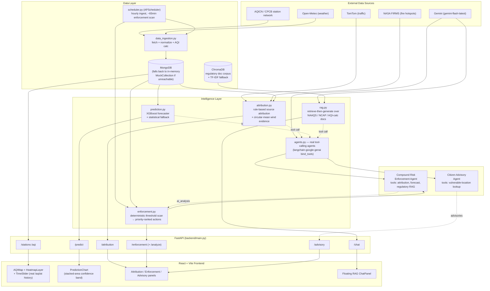

# VayuDrishti — System Architecture

This diagram reflects what the codebase actually does, not an aspirational pitch: every
box below corresponds to a real, runnable module in `backend/` or `frontend/src/`.

## High-level flow

## Why this differs from a typical "AQI dashboard"

Most teams tackling this problem statement will ship a map with colored dots and maybe
a chart. Three things in this architecture specifically target the judging rubric:

**1. The agents are real tool-calling loops, not prompt wrappers.**
`backend/services/agents.py` binds Gemini to actual Python tools via
`ChatGoogleGenerativeAI.bind_tools()` and runs a ReAct-style loop
(`_run_tool_calling_agent`) where the model decides which tool(s) to call and in what
order. The **Compound Risk Enforcement Agent** is what the problem statement calls a
"Compound Risk Detection Engine" concretely: it takes a single rule-detected pollutant
breach and independently cross-references source attribution *and* the forecast trend
before deciding whether it's an isolated blip or a genuine compound risk — the same
kind of correlation a single sensor can't make on its own.

**2. The ML forecaster is evaluated the way the problem statement asks.**
`backend/ml/train_model.py` builds real lag/rolling features from a chronologically
ordered time series (pandas `shift`/`rolling`, not independent random draws), splits
train/test by time (not randomly, which would leak the future into training), and
reports RMSE against a naive persistence baseline — the exact metric named in the
evaluation focus. Current run: **14.3 RMSE vs. 19.4 persistence baseline (+26%
improvement)**.

**3. Every "AI" path has a deterministic fallback.**
No feature depends on an LLM being reachable. If `GEMINI_API_KEY` is unset or a Gemini
call fails, advisories fall back to static templates, enforcement stays fully
rule-based, and forecasts fall back to a statistical (mean-reversion + diurnal +
compounding-uncertainty) model. If MongoDB is unreachable, `models/database.py`
transparently swaps in an in-memory mock database supporting the query operators the
app actually uses. A fresh clone with zero configuration is a fully working demo.

## Data flow for a single "compound risk" detection, end to end

1. `scheduler.py` triggers `enforcement.scan_for_anomalies_and_generate_actions(city)`
   every ~65 minutes (also runs on-demand the first time a city's actions are requested).
2. It scans recent readings per station against CPCB alert thresholds (PM2.5, PM10,
   SO2, NO2), computing breach duration and severity ratio, and generates a
   priority-ranked, rule-based enforcement action — fast, deterministic, free.
3. From the frontend's Enforcement Desk, an operator can click **"Run AI Compound-Risk
   Analysis"** on any action, hitting `POST /enforcement/actions/{id}/analyze`.
4. `enforcement.get_ai_analysis()` calls `agents.analyze_enforcement_action()`, which
   runs the Compound Risk Enforcement Agent: it calls `lookup_source_attribution` and
   `lookup_forecast_trend` (and optionally `lookup_regulatory_context`) as tools, then
   returns a structured verdict (`compound_risk`, `confidence`, `rationale`,
   `regulatory_basis`, `recommended_escalation`), which is cached on the action document
   so repeat requests don't re-spend an LLM call.

## Scalability notes

- Adding a city is a `stations.json` entry + an entry in `CITIES_COORDS`
  (`data_ingestion.py`) — no code changes to routers, services, or the frontend, which
  all key off `city` as a plain string.
- The XGBoost model is trained on pooled multi-station data with station-agnostic
  features, so onboarding a new city's stations does not require retraining a
  per-station model.
- MongoDB collections are indexed on `(station_id, timestamp)` and `city`; the same
  schema scales from 8 demo cities to CPCB's full 900+ station network without
  structural changes.
