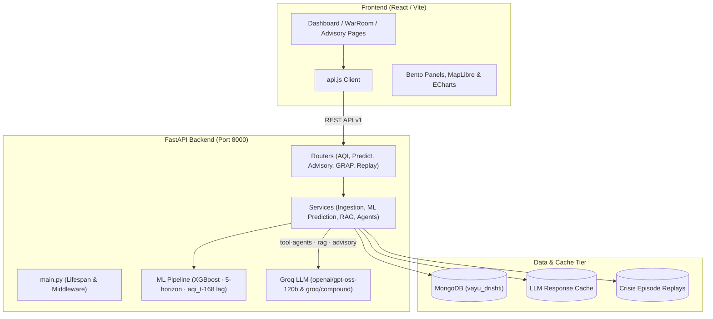

# CODEBASE_GRAPH.md — Full System Relationship & Knowledge Graph

> Generated by Graphify for VayuDrishti (वायुदृष्टि).
> Automatically maps the call paths, module relationships, and API-to-database contracts.

---

## 1. High-Level System Architecture

---

## 2. API Endpoints & Route Map

| Router | File | Exposed Endpoints |
|---|---|---|
| **Advisory** | `backend/routers/advisory.py` | `GET /citizen` `GET /vulnerability-map` `POST /generate` |
| **Aqi** | `backend/routers/aqi.py` | `GET /current` `GET /at` `GET /history` `GET /heatmap` `GET /compare` |
| **Attribution** | `backend/routers/attribution.py` | `GET /sources` `GET /evidence` `GET /industrial` |
| **Chat** | `backend/routers/chat.py` | `POST /query` |
| **Data** | `backend/routers/data.py` | `GET /gov-feed` `GET /gov-feed/coverage` `POST /ingest` `POST /seed` `GET /status` |
| **Enforcement** | `backend/routers/enforcement.py` | `GET /actions` `GET /actions/{action_id}` `POST /actions/{action_id}/analyze` `PATCH /actions/{action_id}` |
| **Grap** | `backend/routers/grap.py` | `GET /status` `GET /schedule` |
| **Health** | `backend/routers/health.py` | `GET /city` `GET /action` |
| **Predict** | `backend/routers/predict.py` | `GET /forecast` `GET /explain` `GET /alerts` `POST /trigger-forecast` |
| **Replay** | `backend/routers/replay.py` | `GET /episodes` `GET /episodes/{episode_id}` `POST /episodes/{episode_id}/seed` |
| **Stations** | `backend/routers/stations.py` | `GET /` `GET /{station_id}` `GET /{station_id}/readings` |
| **Trajectory** | `backend/routers/trajectory.py` | `GET /back` |

---

## 3. Backend Services & Core Responsibilities

| Service | Key Classes / Functions | Primary Responsibility |
|---|---|---|
| **advisory** | `get_aqi_category`, `get_advisories_for_zone`, `get_vulnerability_map_data` | Handles advisory logic & database queries |
| **agents** | `lookup_source_attribution`, `lookup_forecast_trend`, `lookup_regulatory_context`, `lookup_vulnerable_locations`, `analyze_enforcement_action`, `generate_citizen_advisory_agentic` | Handles agents logic & database queries |
| **attribution** | `sector_index`, `percentile`, `compute_cpf_rose`, `bearing_deg`, `angular_distance`, `diurnal_traffic_profile`, `seasonal_fire_prior`, `fetch_firms_hotspots` | Handles attribution logic & database queries |
| **data_ingestion** | `calculate_indian_aqi`, `get_sub_index`, `sub_index_to_concentration`, `generate_simulated_readings`, `fetch_openmeteo_weather`, `fetch_aqicn_aqi`, `fetch_openweathermap_aqi`, `ingest_live_data_for_station` | Handles data ingestion logic & database queries |
| **enforcement** | `scan_for_anomalies_and_generate_actions`, `get_actions_by_city`, `get_action_by_id`, `get_ai_analysis`, `update_action_status` | Handles enforcement logic & database queries |
| **gov_feed** | `fetch_records`, `coverage_summary` | Handles gov feed logic & database queries |
| **grap** | `stage_for_aqi`, `find_sustained_crossing`, `ols_slope`, `evaluate_city` | Handles grap logic & database queries |
| **health_impact** | `aqli_life_years_lost`, `who_attributable_fraction`, `city_health_impact`, `action_impact` | Handles health impact logic & database queries |
| **llm_cache** | `cache_key`, `get`, `set`, `get_or_generate`, `stats` | Handles llm cache logic & database queries |
| **prediction** | `lag`, `generate_statistical_forecast`, `diurnal_effect`, `get_forecast_for_station`, `explain_forecast`, `get_alerts_for_city` | Handles prediction logic & database queries |
| **rag** | `retrieve`, `query`, `generate_rag_response` | Handles rag logic & database queries |
| **replay** | `parse_at`, `list_episodes`, `get_episode`, `episode_covering`, `generate_reading`, `ensure_episode_seeded`, `fire_count_near`, `fire_points` | Handles replay logic & database queries |
| **scheduler** | `periodic_ingestion`, `periodic_enforcement_scan`, `start_scheduler` | Handles scheduler logic & database queries |
| **trajectory** | `back_trajectory` | Handles trajectory logic & database queries |

---

## 4. Frontend Component & Page Hierarchy

### Pages (`frontend/src/pages/`)

- **`Advisory`** (`frontend/src/pages/Advisory.jsx`)
- **`Compare`** (`frontend/src/pages/Compare.jsx`)
- **`Dashboard`** (`frontend/src/pages/Dashboard.jsx`)
- **`Enforcement`** (`frontend/src/pages/Enforcement.jsx`)
- **`Predictions`** (`frontend/src/pages/Predictions.jsx`)
- **`WarRoom`** (`frontend/src/pages/WarRoom.jsx`)

### Component Categories (`frontend/src/components/`)

- **Charts**: `AQITrendChart`, `CityComparisonChart`, `PollutantBreakdown`, `PredictionChart`, `ShapWaterfall`, `SourcePieChart`, `WindRose`
- **Common**: `AlertCard`, `AQIBadge`, `LoadingSpinner`, `ProvenanceBadge`, `ReplayBanner`
- **Layout**: `Footer`, `Navbar`, `Sidebar`
- **Map**: `AQIMap`, `TimeSlider`
- **Panels**: `AdvisoryPanel`, `ChatPanel`, `EnforcementPanel`, `GovFeedPanel`, `GRAPPanel`, `HealthImpactPanel`, `IVRPreview`

---

## 5. API Client Call Graph (`frontend/src/services/api.js`)

| API Service Export | Methods Available | Backend Target |
|---|---|---|
| **`replayApi`** | `episodes`, `episode` | `/api/v1/replay` |
| **`stationsApi`** | `list` | `/api/v1/stations` |
| **`aqiApi`** | `current` | `/api/v1/aqi` |
| **`predictApi`** | `forecast` | `/api/v1/predict` |
| **`attributionApi`** | `sources` | `/api/v1/attribution` |
| **`enforcementApi`** | `actions` | `/api/v1/enforcement` |
| **`advisoryApi`** | `citizen` | `/api/v1/advisory` |
| **`grapApi`** | `status` | `/api/v1/grap` |
| **`healthApi`** | `city` | `/api/v1/health` |
| **`trajectoryApi`** | `back` | `/api/v1/trajectory` |
| **`chatApi`** | `query` | `/api/v1/chat` |
| **`dataApi`** | `ingest`, `seed` | `/api/v1/data` |

---

## 6. Degradation & Fallback Call Chains (Non-Negotiable)

```mermaid
flowchart TD
    subgraph AdvisoryLadder["Advisory Degradation Ladder"]
        A1["LangChain Tool-Calling Agent (ChatGroq / openai/gpt-oss-120b)"] -->|Quota/Fail| A2["Groq Fast LLM Call (groq/compound)"]
        A2 -->|Timeout/429| A3[Deterministic Rule & Template Engine]
    end

    subgraph IngestionLadder["Ingestion Degradation Ladder"]
        I1[AQICN Live Real-Time API] -->|Fail/Missing| I2[OpenWeatherMap Air Quality API]
        I2 -->|Fail/No Key| I3[Physically-Grounded Mathematical Simulator]
    end

    subgraph ForecastLadder["Forecasting Degradation Ladder"]
        F1[Trained XGBoost Regressor] -->|Missing Features/Weights| F2[Lag-Statistical Weighted Rolling Forecaster]
    end
```

